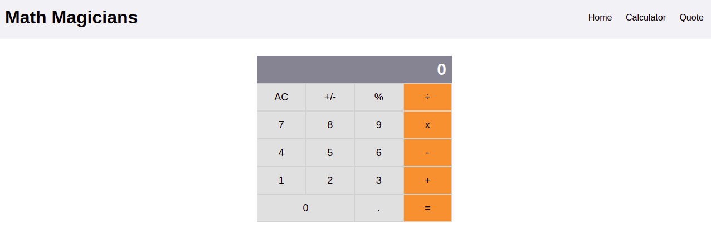

<p align="center">
  <a href="https://github.com/jcy2704/oop-ruby">
    
  </a>
</p>

<h1 align="center">Calculator React</h1>

<p align="center">
  <strong>Made by Alan Soto</strong>
  <br>
    A basic calculator app with the purpose of learning about React core concepts like elements,  stateless and stateful components, props, lifting state up, etc. 
</p>



<hr>

<p align="center">
  <a href="https://github.com/AlanSoto31/calculator-react/issues">
    
  </a>
   ‎ ‎ ‎ ‎
  <a href="https://github.com/AlanSoto31/calculator-react/issues">
    
  </a>
</p>

<hr>


## Table of Contents

- [Live Demo](#Live-Demo)
- [Built With](#built-With)
- [🖥️ Getting Started](#getting-Started)
  - [Prerequisites](#prerequisites)
  - [Setup](#setup)
  - [Testing](#testing)
- [👥 Author](#author)
- [🤝 Contributing](#contributing)
- [⭐ Show your support](#show-your-support)
- [Acknowledgments](#acknowledgments)


## Live Demo

[Live version](https://calculator-react31.herokuapp.com/)


## Built With

- JavaScript
- React
- VS Code


## Getting Started

Get a local copy, type on console...

````
 $ cd <'the location yo want to save the project'>
 $ git clone https://github.com/AlanSoto31/calculator-react.git
 ````


### Prerequisites

- nodejs 14.16.0


### Setup

1. Go inside the project folder: `cd calculator-react`.
2. Install dependencies: `npm install`.
4. Start the application: `npm run start`
5. Wait for the server to launch the app.
6. Stop the application: `ctrl + c`


### Testing

1. Go inside the project folder: `cd calculator-react`.
2. Run the test: `npm run test`.


## Author

👤 **Alan Soto**

- GitHub: [@AlanSoto31](https://github.com/AlanSoto31)
- Twitter: [@Alan_Soto31](https://twitter.com/Alan_Soto31)
- LinkedIn: [Alan Soto](https://www.linkedin.com/in/alan-soto-valle/)


## Contributing

Contributions, issues and feature requests are welcome!

Feel free to check the [issues page](https://github.com/AlanSoto31/calculator-react/issues).


## Show your support

Give a ⭐️ if you like this project!


## Acknowledgments

- [Microverse](https://www.microverse.org/)


## 📝 License

This project is [MIT](https://opensource.org/licenses/MIT) licensed.